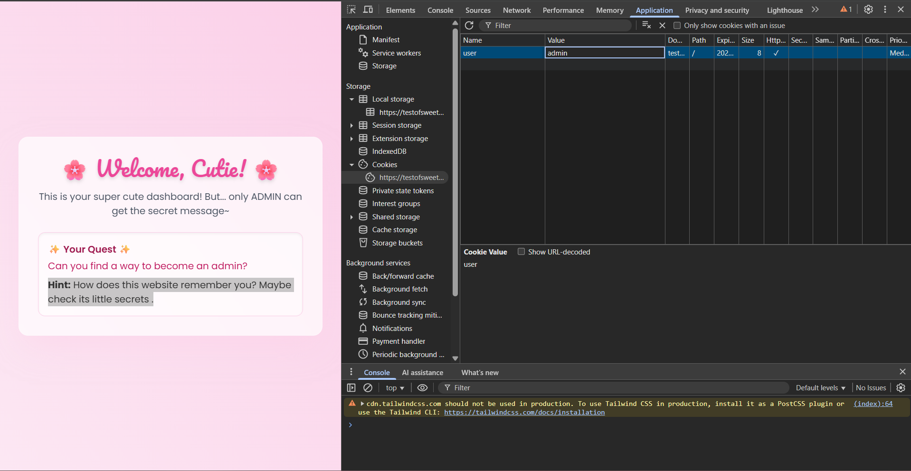
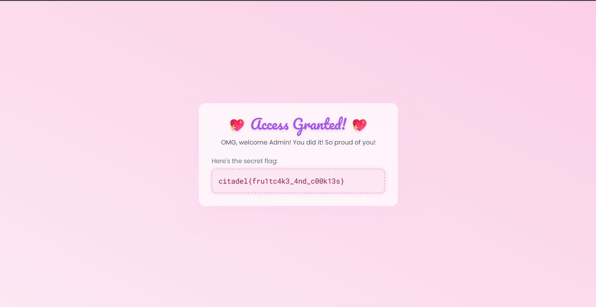
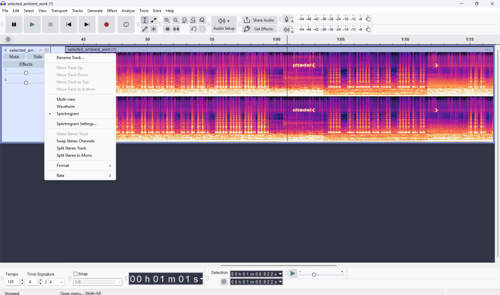
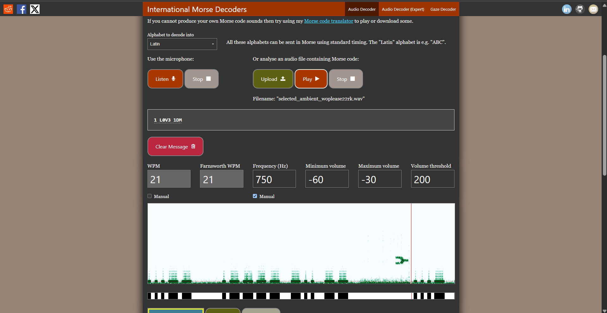
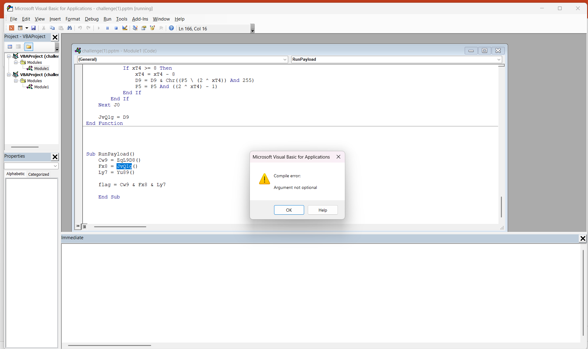
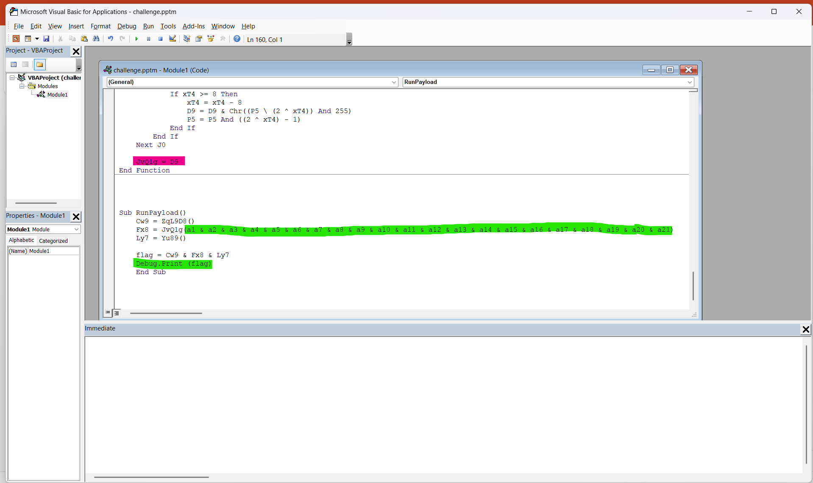
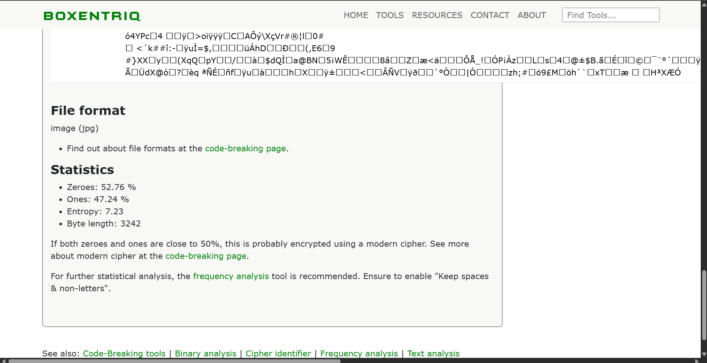
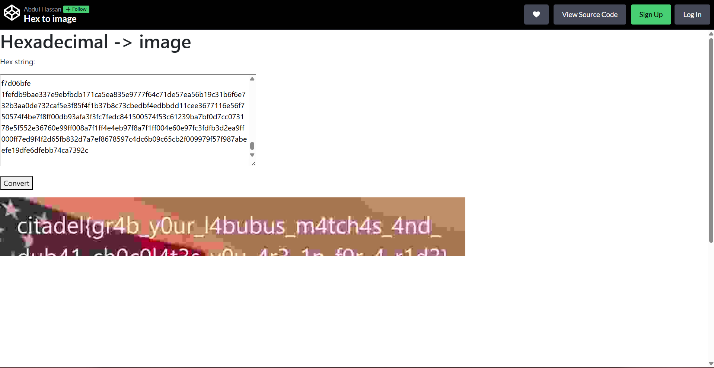
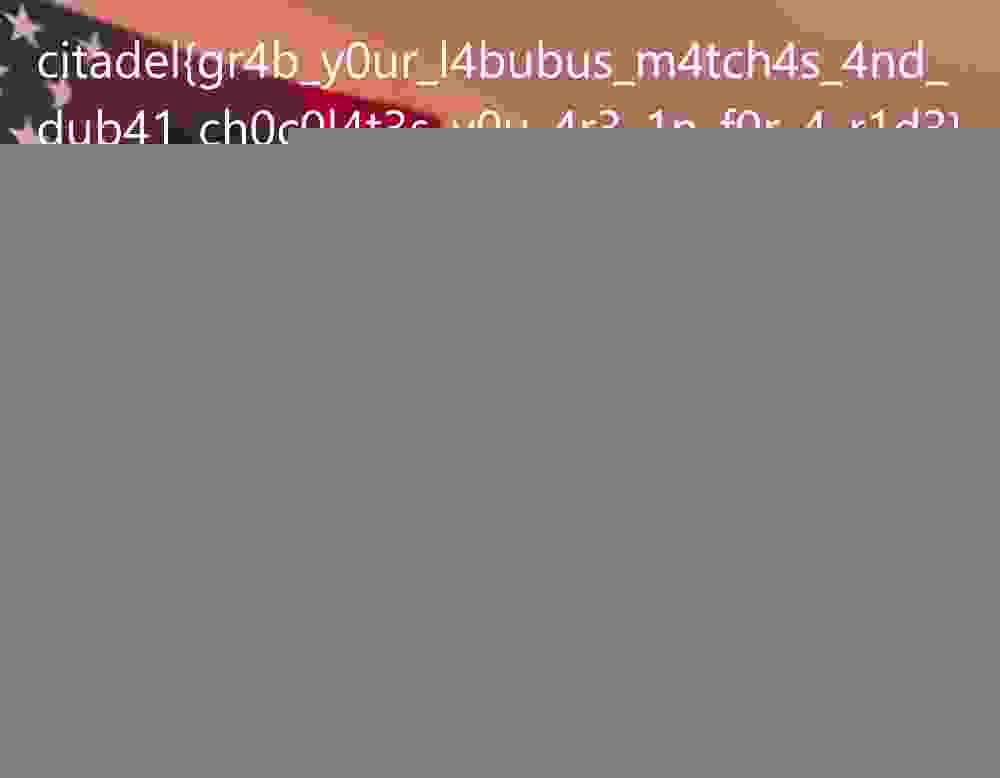

# Challenge 1 Test of Sweetness

This floor feels like a digital world. The space is an illusion, all pink and sweet, stretching around you in impossible patterns. Here, you are no longer a climber but just another user.

Ahead, a door glows faintly. It is the only path forward and requires a level of authority you do not yet have. Fragments of session memory flicker, hinting at what it might take to gain higher access.

Challenge: [https://testofsweetness.citadel.cryptonitemit.in](https://testofsweetness.citadel.cryptonitemit.in)

## Solution:

Through the hint "Hint: How does this website remember you? Maybe check its little secrets.", we can infer that we need to modify the cookies. On inspect element we need to change the value of cookie from user to admin to get the flag.




## Flag: 

```
citadel{fru1tc4k3_4nd_c00k13s}
```


# Challenge 2 Selected Ambient Work

The symphonic adventure does not end here. On the next floor, a single song keeps echoing through the floor, repeating in a haunting loop. Amid the sound, you find a note left by a past candidate. It hints that the song holds a secret message, hidden in plain sight, much like how Aphex Twin concealed his face within his music with the help of spectrograms.

To move forward, you must find the message hidden in this sound.

Note: Separate the words in the flag with _ and make it UPPERCASE. Example: citadel{S3L3CT3D_AMB13NT_W0RK}

File - [selected_ambient_work.wav](selected_ambient_work.wav)

## Solution:

On opening the file in audacity and changing view to spectogram, we can see the word "citadel{}"



This shows that the flag is present in the region enclosed in the curly bracket.

The audio in the specific region has the flag encoded in morse code and can be obtained using an audio morse code translator like [Morse Code Adaptive Audio Decoder](https://morsecode.world/international/decoder/audio-decoder-adaptive.html).



Then the flag then needs to be enclosed in `citadel{}`.

## Flag: 

```
citadel{1_L0V3_1DM}
```


# Challenge 3 Viral Bionic Anomaly

This floor is haunted by a phantom of the past. You encounter a presentation created by the last employee of a forgotten corporation, made just minutes before the Citadel awoke.

Rumor has it that the corporation predicted the rise of the Citadel. Within the slides, a "starter pack" holds the clues you need. Use it to confront the "final boss", a threat trapped inside a macro hidden deep within the presentation, and claim the key to the next floor.

[challenge.pptm](challenge(1).pptm)

## Solution:

After running the macro in powerpoint, since there was an error -



So we need to debug the vba code



Now we get the output as [output](vba3.txt) which is clearly hexadecimal code, on hex analysis using [boxentriq](https://www.boxentriq.com/code-breaking/hex-analysis) we get-



Since the file is of type `jpg`, we can use a hex to image converter like [hex to image](https://codepen.io/abdhass/full/jdRNdj) we get the output-



and on downloading the file we get 



So we can make out the flag to be `{gr4b_y0ur_l4bubus_m4tch4s_4nd_dub41_ch0c0l4t3s_y0u_4r3_1n_f0r_4_r1d3}`

## Flag: 

```
citadel{gr4b_y0ur_l4bubus_m4tch4s_4nd_dub41_ch0c0l4t3s_y0u_4r3_1n_f0r_4_r1d3}
```